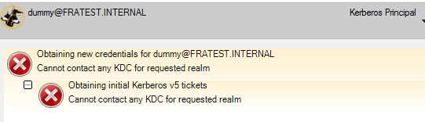
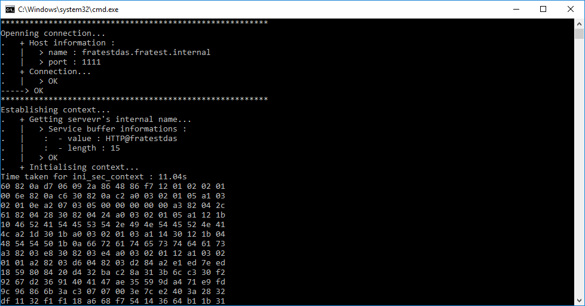

<style>
body {
  font-size: 14px !important;
  font-family: Inconsolata, Monaco, Consolas, 'Courier New', Courier !important;
  text-align: justify !important;
  text-justify: inter-word !important;
  line-height: 1.45;
  color: #3f3f3f;
}
h1 {
  font-size: 2.6em !important;
  font-family: inherit !important;
  font-weight: 300 !important;
  line-height: 1.1 !important;
  color: inherit !important;
  outline: none !important;
  text-decoration : none !important;
}
h2 {
  font-weight: 300 !important;
  line-height: 1.1 !important;
  color: inherit !important;
  font-size: 2.15em !important;
}
h3 {
  font-weight: 300 !important;
  line-height: 1.1 !important;
  color: inherit !important;
  font-size: 1.8em !important;
}
img {
  display: block;
  margin-left: auto;
  margin-right: auto;
}
</style>
# OSISoft Internship - Week 4

Here is a quick summary of my fourth week.

## Where I was

At the end of the third week, I was still trying to understand how does the GSS-API authenticates itself from a client to a server. I had some functions working but the project was not completed yet. I had the windows socket connection, and the first gss function as import name working.

## What I did

During the first part of the week I kept **developing my client/server application**. I spent some time on understanding how the credentials are working. When I tried to execute the gss function `gss_acquire_credentials()` I had errors witch seemed to be caused by kerberos configuration, and more precisely from my **Key Distribution Center** :



> The link between GSS-API and kerberos is done via the credentials. Is probably is the reason why I got stuck from here : I can't find a real "how to configure" kerberos on windows. For now I think : Domain controller should act as Key Distribution Centre; The application should have a keytab in order to obtain credentials, client doesn't really need credentials he gets his on log on.

I asked to Ramata some help for the credentials and she told me that, in their project, they are using ***GSS_C_NO_CREDENTIALS*** but I'm not sure this will call the Kerberos authentication. Same for the security context using *GSS_C_NO_CONTEXT*. Still it allowed me to go on the development.

I tried to execute the function `gss_accept_sec_context()` on the server side to establish the security context between both parts. However, I always had an error : *"The token was a duplicate of an earlier token"*.

I figured out that `gss_init_sec_context` **isn't communicating with the server itself**. In fact, it generates a token and a context that we then need to send to the server. For this I will be using windows sockets. I found some functions doing it in different samples, but I then figured out that they are all using function *read()* and *write()* witch aren't API calls but POSIX I/O i.e. **Unix system** ! So I then started developping my own send_token and receive_token using *send()* and *recv()*.

Here we have a quick tab to summarize how is the application I make sequenced :

Server                     | Client
---------------------------|-------------------------
Import Name                | -
Acquiring Credentials      | -
Creating a socket          | -
Waiting for token          | Connecting to the socket
""                         | Import service name
""                         | Init sec context
Recieving token            | Sending token
Accepting security context | -

I finally had those two function so I can send this token via windows sockets. And that's when I found the issue I was looking for : the client was taking more than **10 seconds** before sending the token. so I used clocks to locate where were this happening. It finally was during the execution of `gss_init_sec_context()` :

```c++
clock_t tStart = clock();
majStat = gss_init_sec_context(&minStat,
  GSS_C_NO_CREDENTIAL,
  &ctx,
  ...
  nullptr);
printf("Time taken for ini_sec_context : %.2fs\n", (double)(clock() - tStart) / CLOCKS_PER_SEC);
```

Leads me to this result :



**I have the same delay as in the original project because of `gss_init_sec_context`()**

---

For the second part of the week, I found witch instruction takes too long in the gssapi windows client's execution. Moreover, this instruction in fully contained in the gssapi. Then if I want to improve the time execution I have to modify this library. For this I downloaded the source code from MIT's website and then I tried to build it to then be able to debug and modify it.

To build the library I needed several things :
* Unix commands such as cp/cat/ls/awk
* One perl version
* Visual command prompt
* XML toolkit
* windows SDK

Every thing is detailed in [kerberos wiki](http://k5wiki.kerberos.org/wiki/Kerberos_for_Windows_%28KfW%29_Build_Environment) and [kerberos github](https://github.com/krb5/krb5/tree/master/src/windows). However, even with everything installed I still had a lot of errors such as `Error C2039 '_flag': is not a member of '_iobuf'`

Witch results to be a use of previous (2010) definition of iobuf :
```
struct _iobuf {
    char *_ptr;
    int   _cnt;
    char *_base;
    int   _flag;
    int   _file;
    int   _charbuf;
    int   _bufsiz;
    char *_tmpfname;
    };
typedef struct _iobuf FILE;
```
Witch is now :
```
typedef struct _iobuf
{
    void* _Placeholder;
} FILE;
```

I first managed to build the dlls ignoring these errors, but it finally comes that some symbols were missing in it.

I then decided to install a new VM exclusively for this build as I had a lot of components interfering in the build on the other. So I installed once again all the components and Visual Studio Enterprise  2010.


## What I have to do

- Complite the installation of the new VM.
- Build the library complete and without qny errors.
- Debug the function `gss_init_sec_context()`.
