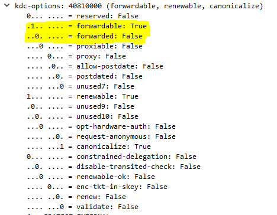
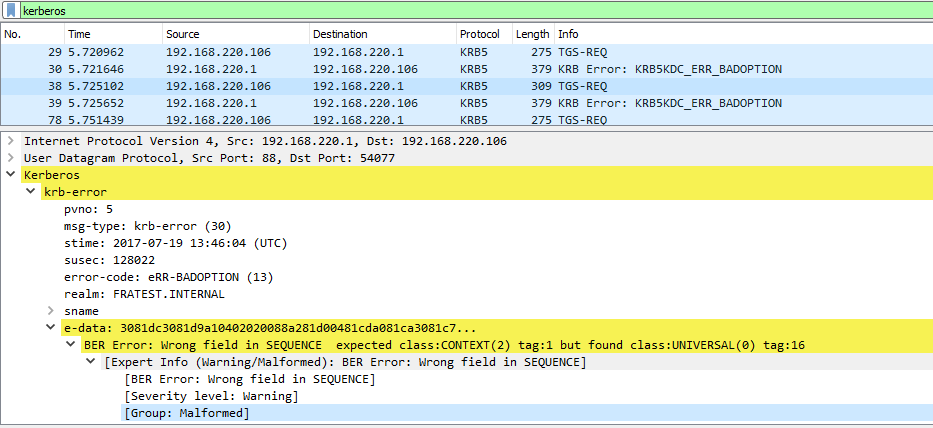

# OSISoft Internship - Week 6

Here is a quick summary of my sixth week.

## Where I was

At the beginning of the week, I didn't exactly know what is the release version using and what should I use instead or how should I change it. So this basically was the objectif of my week : clarifying everything.

## What I did

First of all, I did a lot of researches on the different technologies that the project is using. Here is a quick summary of each key name and its functions :
### SSPI
* Using kerberos
* doesn't establish credentials
* Uses windows socket 2

### SChannel
* Authentication
* link between SSPI and kerberos

### GSS-API
* Using Kerberos to get credentials
* doesn't send in network
* just handle tokens

### GSoap
* Uses openSSL for HTTPS
* Creates connection

### winHTTP
* Server based technology
* Service HTTP
* Establish communication
* Support Kerberos authentication
* Uses SSL 3.0

### openSSL
* Transport
* Secure Socket Layout
* Cryptography

 This "glossary" helped me to understand the project development and which choises we have for the development of a new connection.

What I did then was **building the debug version** of the project and tried to understand how is it working. Here are the files that will interest me the most :

1. ODBCConnection.cpp
1. PI ODBC connection.cpp
1. Connection Helper
1. ThreadContextCreator() -> Pool -> isTruedConnection
2. CreateOrb
3. CreateRdsaConnection

A lot of things seemed strange to me. For example, if I use winHTTP, I couldn't create a Token if the DAS isn't trusted. When the token cannot be created, I couldn't see kerberos messages through the network. Whereas when it is working we can see the token offered by the KDC, and the different flags it have :

Maybe one solution to use the existing code without using de domain controller would be to use a delegation token witch can be created from an existing token (*Cf. [delegation token](https://auth0.com/docs/tokens/delegation) and [Kerberos concepts](https://www.cloudera.com/documentation/enterprise/5-8-x/topics/cm_sg_principal_keytab.html)*).

We can also notice that the connection is working when creating **manually a token** on the client.

**It must exist a difference between Dummy and Boss**. Indeed, with Dummy, if I get a ticket, I can then connect to the DAS. But with boss, I have the expected error when a user isn't trusted : *"Cannot connect to server 'FRATESTAS'."*. Here is the error that I can see when this happens :

So I looked for the `KRB5KDC_ERR_BADOPTION` and found that :

>The most common scenario is a request for a delegated ticket (unconstrained or constrained delegation). You will typically see this on the middle-tier server trying to access a back-end server. There are several reasons for rejection:
1. The service account is not trusted for delegation
2. The service account is not trusted for delegation to the SPN requested
3. The user’s account is marked as sensitive
4. The request was for a constrained delegation ticket to itself (constrained delegation is designed to allow a middle tier service to request a ticket to a back end service on behalf on another user, not on behalf of itself).

I finally figured out that I configured, on my first week of this internship when installing my environment, **a trusted on the AF** _(Cf. DAS manual in which is explained how to configure this)_ server and not only on the domain controller. So this finally explained a lot of strange happening that I could not understand on this ODBC client behavior.

From here, I finally could build the project and every configuration was now coherent with y understanding of the issue. This was the first step which was quite important : understand what is the current solution using, what are the issues and what can we try to change to fixe those.

## What I have to do

Change the connection between ODBC DAS and AF so  it can use delegation without trusting the Data access server.

## Appendix
### Questions I had:

* What release currently uses ?
> Everything is using Gsoap, and winHTTP to communicate with DAS
* Should I automatically get a krb ticket ?
> Not with the version he did but if we want to release it, it should be part of the software
* How can I enable winhttp in project ?
> The token is automatically generated and handled by microsoft libraries with the option AUTOLOGON SECURITY LEVEL LOW.
* When is GSS-API using openSSL if used with GSoap
> Encryption
* Does winHTTP really need DS intervention ?
> Yes, I had configurated a trust on the AF server
* How can I see ticket's flags when using TCT of https connection ?
> I can't

### What are the differets solutions :
1. Using GSS-API, but **still dependant of OpenSSL**
2. Using winHTTP and **configure Domain Controller to trust de DAS**  : *No good : no DC rights*
3. Using one of the both and **configure the DAS to be PrincipalAllowedToDelegateToAccount**  *No good no AF rights*
