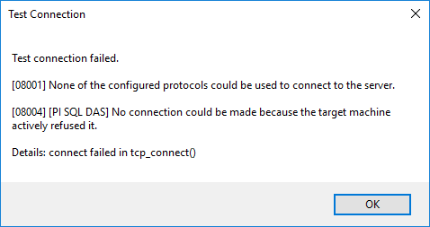

<style>
body {
  font-size: 14px !important;
  font-family: Inconsolata, Monaco, Consolas, 'Courier New', Courier !important;
  text-align: justify !important;
  text-justify: inter-word !important;
  line-height: 1.45;
  color: #3f3f3f;
}
h1 {
  font-size: 2.6em !important;
  font-family: inherit !important;
  font-weight: 300 !important;
  line-height: 1.1 !important;
  color: inherit !important;
  outline: none !important;
  text-decoration : none !important;
}
h2 {
  font-weight: 300 !important;
  line-height: 1.1 !important;
  color: inherit !important;
  font-size: 2.15em !important;
}
h3 {
  font-weight: 300 !important;
  line-height: 1.1 !important;
  color: inherit !important;
  font-size: 1.8em !important;
}
img {
  display: block;
  margin-left: auto;
  margin-right: auto;
}
.codeTitle {
  font-style: italic;
  line-height: 0%;
  font-size: 80%;
}
</style>
# OSISoft Internship - Week 8

Here is a quick summary of my eighth week.


## Where I was

Now I had quite a good idea of where is the problem and I start to understand how every entity of the ODBC client are functioning together. I still have to find the best solution to allow this delegation without openSSL.

## What I did ?

### OpenSSL

#### Building GSSApi

My mission of this week wasn't really clear at the beginning of this week. Indeed, something wasn't clear for me : I didn't really knew where gssapi use openSSL and didn't know does our project depend on openSSL updates. Finally I figured out that I never built correctly the version using GSSapi of the project. I though I couldn't undefine the `win32` symbol used for declaring the winHTTP plugin :
```C++
#ifdef WIN32
   soap_register_plugin(&spThreadContext->proxy, winhttp_plugin);
#endif
```
But I only had to comment this line and then compile with the symbols `WITH_GSSAPI` but also `WITH_OPENSSL`. Those are two totally different components. Finally, I saw real difference with my modification and the previous version. Almost everything was clear, except one thing : **Why do we need openSSL ?**

Indeed, when I made my sample I had a connection using gssapi without openSSL installed. Moreover, I think the gssAPI version is also using GSoap for transportation, so what is openSSL used for? To figure out this I first had to learn more about SSL as I never used it before this internship.

> Note : I couldnot build the complete GSSAPI version before because I couldn't access the NuGet package managment as I didn't have the OSISoft package server I had the error **"Central Directory Corrupt"**. I had everything this week so I could install with my credentials every packages adding openSSL.

#### What is a SSL library ?

_SSL = Security Socket Layer_

As its name can suggest, a SSL library takes care of the **SSL protocol**. This protocol has as objective to allow a secured and trusted connection on an insecure network. To do so, the SSL protocol allows to **Encrypt** the communication, and to **Authenticate** the parties. Most of the time it is using SSL certificates to identify and authenticate both parties.

> I think it is important to note that SSL is deprecated to be used on Internet and is now succeeded by the Transport Socket Layer (TSL). Although SSL term is still used to refer to protocols enabling a secured connection on public network.

Both SSL and TSL protocol handle the communication (encryption and authentication) at the **transport layer** of the OSI model :

| Application   |
|---------------|
| Presentation  |
| session       |
| **Transport** | SSL / TSL       |
| **Network**   | GSoap / Sockets |
| Data Link     |
| Physical      |

So this protocol sits on the **Network** layer which is responsible for **transporting data** from a process to the other. This data transport can be done with Gsoap, sockets, HTTP libraries or any other technology.


SSL libraries are various and numerous. Here are some most used examples :
* mbed TLS
* PolarSSL
* LibreSSL
* cryptlib
* openSSL
* GnuTLS
* Network Security services
* wolfSSL

SSL uses two different subprotocol : record and handshake. When the handshake is done the server and the client use some **digital certificates** with some **public and shared keys** to authenticate each other. So both the client and the server runs the SSL protocol.

#### SSL in our project : openSSL

Now that I had basics, I could try to understand the SSL use in our project. To have a basic sample of openSSL, I used this article from IBM : [article](https://www.ibm.com/developerworks/library/l-openssl/index.html)

The creation of a basic openSSL connection is done by, first loading the trust store :
```C++
SSL_CTX * ctx = SSL_CTX_new(SSLv23_client_method());
SSL * ssl;
```
and we can find it the "WITH_OPENSSL" project : <div class="codeTitle">stdsoap2.cpp :</div>
```C++
/* SSLv23_method: a TLS/SSL connection established may understand the SSLv3, TLSv1, TLSv1.1 and TLSv1.2 protocols. */
soap->ctx = SSL_CTX_new(SSLv23_method());
```
And I think SSL is only used for generating the context in our code not even for the connection.

the functions from openSSL used in our project are :
* SSL_CTX_new()
* SSL_CTX_set_default_verify_paths()
* SSL_OP_NO_TICKET
* SSL_CTX_set_options
* SSL_CTX_set_verify
* SSL_CTX_set_verify_depth

So maybe we can find another way to create this context but it has to be understandable by the serverside. So I also tried to see **How is the context created with winHTTP**

### WinHTTP

I just did some little modification in the gsoapwinHTTP as I was trying to see how is this context done with winHTTP

update winHTTPOpen which was deprecated :
```c++
/* start our internet session */
  a_pData->hInternet = WinHttpOpen(L"gSOAP",	// User agent who will use winHTTP
    WINHTTP_ACCESS_TYPE_AUTOMATIC_PROXY,		// Type of access WINHTTP_ACCESS_TYPE_DEFAULT_PROXY Deprecated
    WINHTTP_NO_PROXY_NAME,					// String with the proxy name
    WINHTTP_NO_PROXY_BYPASS,					// IP When using proxy name
    0);
```

Add secutiry level change test (_winhttp_init()_):
```c++
/* enable windows integrated authentication */
   DWORD level = WINHTTP_AUTOLOGON_SECURITY_LEVEL_LOW;
   if (!WinHttpSetOption(a_pData->hInternet, WINHTTP_OPTION_AUTOLOGON_POLICY, &level, sizeof(level)))
   {
	   soap->error = GetLastError();
	   DBGLOG(TEST, SOAP_MESSAGE(fdebug, "winhttp %p: init, error %d (%s) in InternetOpen\n", soap, soap->error, winhttp_error_message(soap, soap->error)));
	   winhttp_free_error_message(a_pData);
	   return FALSE;
   }
```

Finally I discovered that every step of the authentication using winHTTP is hidden in micrsoft functions that we can't debug. And the delegation isn't really configure, it is just the default behaviour when the security level is defined to LOW. But I saw one article comparing winHTTP and winINet and we could see that the delegation is handled by winHTTP so this is the second solution :

[Impersonation possible !](https://msdn.microsoft.com/fr-fr/library/windows/desktop/hh227298(v=vs.85%29.aspx)

### GSoap

Soap is a **communication protocol**. It is used to **define the format of frames** which will be sent so that both client and server can retrieve the information.

And GSoap is a **compiler** used to create a server or a client.

I did a complete exemple of client server to understand want every files are. I used this [documentation](http://r0d.developpez.com/articles/tuto-gsoap-fr/) to create it. You need to use soapcpp2.exe to generate files for the server and the client. You also need to include `stdsoap2.cpp` and `stdsoap2.h` which are files from the "library".

First a server is composed of 2 parts :
* the principal loop
* the operations' definition

The client can then use functions generated corresponding to the operations (eg `soap_call_op1()`). The sample I made is simple but I understood something very importamt : **the majority of the Gsoap part of the ODBC project is auto-generated** and the important part finally isn't that complicated. Moreover, all the handling of symbols and library use is also done by GSoap like the symbole `WITH_OPENSSL` which is part of GSoap compilation.

### Verdict

From [GSoap documentation](https://www.genivia.com/doc/soapdoc2.html#tth_sEc19.24) :

> To utilize HTTPS/SSL, you need to install the OpenSSL library on your platform or GNUTLS for a light-weight SSL/TLS library. After installation, compile all the sources of your application with option -DWITH_OPENSSL (or -DWITH_GNUTLS when using GNUTLS).

If we want to use HTTPS with GSoap, we need openSSL, so I should probably focus on the solution of changing winHTTP.

### GSSApi Modification summary :

Finally I realized when I was building the gssapi version that I never summarized the modifications that should be done to fixe the 10 second delay on gssapi. So here is a summary of those modifications.

#### Header
You have to add this header file from krb installation :

<div class="codeTitle">GSoapOrbChannelDriver.cpp : </div>
```C++
#include "gssapi/gssapi_krb5.h"
```

#### String service name :

You need to change the server name string from `HTTP@host` to `HTTP/host@` :
<div class="codeTitle">GSoapOrbChannelDriver.cpp : </div>
```C++
std::string serviceName("HTTP@");
serviceName.append(soap->host);
```

```C++
std::string serviceName("HTTP/");
serviceName.append(soap->host);
serviceName.append("@");
```

#### OID name type :
You have to change the OID from `GSS_C_NT_HOSTBASED_SERVICE` to `GSS_KRB5_NT_PRINCIPAL_NAME` :
<div class="codeTitle">GSoapOrbChannelDriver.cpp : </div>
```C++
OM_uint32 minorStatus = 0;
auto majorStatus = gss_import_name(&minorStatus, &inputToken, GSS_C_NT_HOSTBASED_SERVICE, &server);
```

```C++
OM_uint32 minorStatus = 0;
gss_OID_desc oid = *GSS_KRB5_NT_PRINCIPAL_NAME;
auto majorStatus = gss_import_name(&minorStatus, &inputToken, &oid, &server);
```
>Note that you need to declare a variable or the constant type will generate an error.

>> **Do not forget, when you compile using Fiddler you Must have Fiddler running or you will have this error :**
>>


## What I have to do

What is a **Object Request Broker**

What is Boost and how is it used ? [boost](http://www.boost.org/doc/libs/1_47_0/doc/html/boost_asio/overview/ssl.html)
