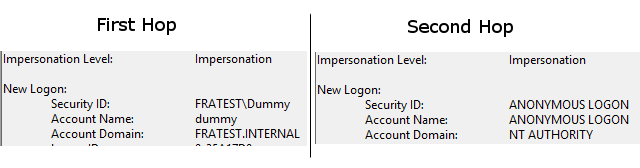

<style>
body {
  font-size: 14px !important;
  font-family: Inconsolata, Monaco, Consolas, 'Courier New', Courier !important;
  text-align: justify !important;
  text-justify: inter-word !important;
  line-height: 1.45;
  color: #3f3f3f;
}
h1 {
  font-size: 2.6em !important;
  font-family: inherit !important;
  font-weight: 300 !important;
  line-height: 1.1 !important;
  color: inherit !important;
  outline: none !important;
  text-decoration : none !important;
}
h2 {
  font-weight: 300 !important;
  line-height: 1.1 !important;
  color: inherit !important;
  font-size: 2.15em !important;
}
h3 {
  font-weight: 300 !important;
  line-height: 1.1 !important;
  color: inherit !important;
  font-size: 1.8em !important;
}
img {
  display: block;
  margin-left: auto;
  margin-right: auto;
}
.codeTitle {
  font-style: italic;
  line-height: 0%;
  font-size: 80%;
}
</style>
# OSISoft Internship - Week 9

Here is a quick summary of my ninth week.

## Where I was

After studying the different options I had last week, it turned out that my best chances seem to be using winHTTP with the GSoap plugin, but I will have to find new possibilities to configure this plugin. Moreover, after this week I will only have one week and half before the end of this internship, so I also should start preparing my presentation for the company and gathering information for my school report.

## What I did

First thing I did this week was to trace the connection when it is using winHTTP to understand where is this error coming from and what does the request look like.

### Tracing the connection

#### Using WinHTTP
First, I tried to trace the connection, using **fiddler** on both the ODEBC Client and the DASA and also regarding which connection attempt can I see in the **AF Logs**.

> Note: Using stateless connection is really useful to only the sessions corresponding to the authentication.

So here are the first two sessions we can see when trying a connection :

<div class="codeTitle">Request : ODBC -> DAS</div>
```
Client :
  gSoap/2.8
Security :
  Authorization: Negociate
  Authorization Header (Negotiate) appears to contain a Kerberos ticket:
```
<div class="codeTitle">Answer : DAS -> ODBC</div>
```
HTTP/1.1 401 Unauthorized :
  Cookies ? Login :
    WWW-Authenticate: Negotiate
    WWW-Authenticate: Basic realm=""
    connection: close
```

On the data access server, we can see one connection from the ODBC User that should be then forwarded. but the second one is "ANONYMOUS LOGON" and I think this may be the problem already :



Finally, looking at the AF logs, I found the same failed logon as for the second hop on the DAS. The connection is then still forwarded even if it does not succeed.

#### Using GSSAPI

I wanted to do the exact same thing when building the project with gssapi, but it turns out that the connection was impossible when using Fiddler's proxy, the delegation wasn't working anymore. So, before trying to find another was to see this communication, I thought about something : If I had the same behavior when building winHTTP and using fiddler ? Maybe the connection have been working but I wouldn't have seen it. So I then tried again every options that I tried before but without Fiddler's proxy enabled.

I disabled Fiddler on both ODBC and DAS and try everything again only using windows security logs from the event viewer.

### Preparing presentation

Before I try anything else, as I will have to present my work and my subject to the company, I also decided to start preparing this presentation. The plan will surely look like something like this :

---
I   - Introdution
  1. Who am I ?
  2. Where was I ?
---
II  - Project presentation
  1. Internship project 2017
  2. context
  3. Project Overview
---
III - First task : GSS-ASI, Connection Delay
  1. Kerberos
  2. GSS Application
  3. My preject (demo)
  4. Problem solution
---
IV  - Second Task : No more OpenSSL
  1. What is OpenSSL ?
  1. What is it used for ?
  1. GSS API without OpenSSL ?
  1. Delegation using winHTTP
---
V   - What did I learn
  1. Technical
  2. Relational
  3. Organizationel
---
VI  - Q&A

---

I knew that I will be talking a lot about Kerberos, for my presentation in the company and also at school, so I wanted to be really clear about how it works and what is each component's role. So I went back to Kerberos documentation as I did the first weeks, but then everything wasn't clear for me, I think I would understand way more now that I am more familiar with it.

#### Kerberos overview

Just to remember and clarify what I know from Kerberos, I read some documentation and wrote a small overview :

*kerberos* Three-headed guard dog of Hades (Greek mythology) : Third part = KDC
##### It allows:
*	Authentication
*	Tickets
*	No password sending on network

#### It is composed of:
*	Kerbors realm
  *	One KDC
    *	Authentication server
    *	Ticket Granting server
  *	Clients
  *	Services

Ticket = proof of identity,
One service = one ticket,
Created localy
Use ticket instead of password (Trusted connection)

**Only the computer knowing you password can use your ticket** witch means you and the KDC who is the DC.

#### Step 1 – You – Authentication Server

1.	When you connect, you send a request for a Ticket Granting Ticket with your ID address etc.
2.	AS checks if you exist in his database (no cred test)
3.	Generating session key for TGS
4.	Send you TGS session key encrypted with you Client Secret key witch you can obtain with your password
5.	But cannot read the TGT (need TSG secret key and not session key) (One you can read not the other)

#### Step 2 – You – TGS

1.	You have the TGT, and TGS session Key
2.	You send Authenticator encrypted with TGS session key
3.	TGS -> KDC database -> Service exists
4.	TGT contains TGS session key -> dept evering
Then :
*	Compare ID
*	Timestamp 2min no more
*	Lifetime
*	TGS’s cache (reply attack)
*	Network address
5.	Returns HTTP Session Key with HTTP secret key

#### Step 3 – You and HTTP Service

1.	You send your ticket for HTTP service
2.	Service decrypt with secret key
3.	Send back his ticket generated by admin
4.	You check
5.	Then can use this ticket which is cached


``` c++
gss_init_sec_context(&minStat, &ctx, servName, &gss_krb5_mech_oid_desc, ...);
```


> My visual license expired which took quite a while to save and reinstall everything on my 3 VM using VS.

## What I have to do

### Building demo client Microsoft SSPI SECURE32.dll
